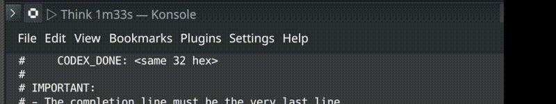

# codex-status

在终端标题栏实时显示 Codex CLI 状态。

[English](README.md) | **中文**



## 核心思想

**问题**: Codex CLI 无法直观显示是否在工作还是等待输入。

**方案**:
1. 注入完成标记 (`CODEX_DONE`) 到 Codex 提示词
2. 监控会话文件 (`~/.codex/sessions/*.jsonl`) 检测状态
3. 通过 OSC 序列在终端标题显示状态

## 状态图标

| 图标 | 状态 | 含义 |
|:---:|:---|:---|
| ▶ | Run | 正在输出 |
| ▷ | Think | 等待中，活动较少 |
| ◇ | Idle | 长时间安静 |
| □ | Free | 等待输入 |
| ■ | Stuck | 超长等待 |
| × | Exit | 进程退出 |

## 安装

### Linux / macOS / WSL

```bash
./install.sh
```

自动配置 shell (zsh/bash)，安装后重启终端。

### Windows (PowerShell)

```powershell
.\install.ps1
```

自动配置 PATH，安装后重启终端。

## 使用

安装后直接运行:

```bash
codex
```

终端标题将实时显示状态。

## 卸载

```bash
./uninstall.sh      # Linux/macOS/WSL
.\uninstall.ps1     # Windows
```

## 配置 (可选)

环境变量:
- `CODEX_STATUS_ICON_STYLE`: `shape` (默认) 或 `emoji`
- `CODEX_STATUS_INTERVAL_S`: 采样间隔 (默认 `2`)
- `CODEX_STATUS_MODEL_STUCK_S`: 卡住阈值 (默认 `900`)
